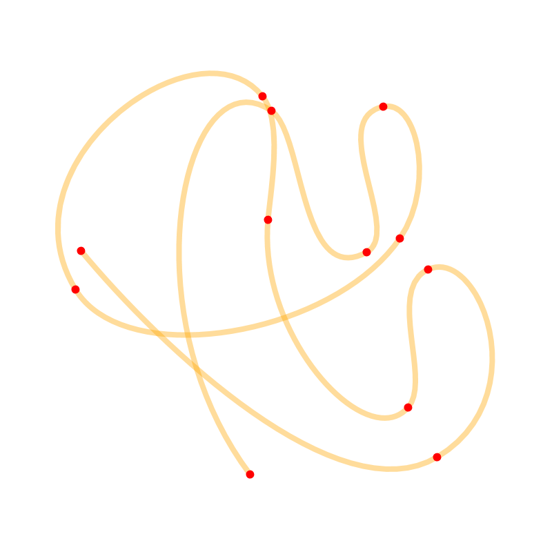
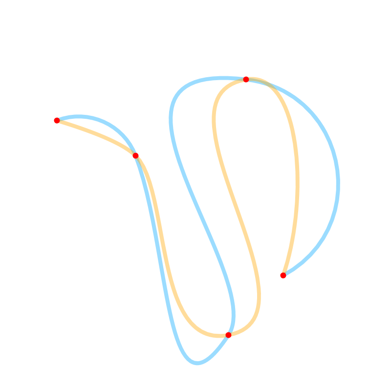

[](https://jitpack.io/#micycle1/Hobby-Curves)

# Hobby Curves

_Hobby Curves_, in Java.

## Overview

John Hobby’s algorithm [[1]] produces a smooth curve through a given set of points. The curve comprises a chain of cubic Bézier curves whose endpoints pass through the points. The parameters of the Bézier curves are chosen such that they join smoothly, forming one long curve through the point set. Hobby Curves are more visually pleasing than curves produced with most other techniques.

This Java library implements both variants of the Hobby Curve: the original "global" algorithm (implementation based on _Luke Trujillo's_ C++ [implementation](https://github.com/ltrujello/Hobby_Curve_Algorithm)) and an incremental variant (implementation based on _loopspace's_ js [implementation](https://github.com/loopspace/jsHobby)).

The global solver keeps the same mathematical formulation as Luke Trujillo’s version, but the linear-system step has been rewritten to use a specialised O(n) tridiagonal / cyclic-tridiagonal solver instead of a general LU decomposition.
In practice this reduces the running time from cubic to linear in the number of knots and removes almost all intermediate allocations, so large curves are generated markedly faster while producing identical results.

## Gallery

<table>
  <tr>
    <td valign="top" width="50%"></td>
    <td valign="top" width="50%"></td>
  </tr>
  <tr>
    <td align="center" valign="center">Hobby Curve (unclosed) of a point set</td>
    <td align="center" valign="center">Original (orange) vs incremental (blue) variants</td>
  </tr>
</table>

## Example

### Global
```
double[][] points = new double[4][2];
points[0] = new double[] { 0.0, 0.0 };
points[1] = new double[] { 10.0, 15.0 };
points[2] = new double[] { 20.0, 0.0 };
points[3] = new double[] { 10.0, -10.0 };

double tension = 1;
double closed = true;
double beginCurl = 1;
double endCurl = 1;

HobbyCurve curve = new HobbyCurve(points, tension, closed, beginCurl, endCurl);

for (double[] bezier : curve.getBeziers()) {
	System.out.println(Arrays.toString(bezier));
}
```

### Incremental
```
IncrementalHobbyCurve curve = new IncrementalHobbyCurve();

curve.addKnot(new double[] { 0.0, 0.0 });
curve.addKnot(new double[] { 10.0, 15.0 });
curve.addKnot(new double[] { 20.0, 0.0 });
curve.addKnot(new double[] { 10.0, -10.0 });

for (double[] bezier : curve.getBeziers()) {
	System.out.println(Arrays.toString(bezier));
}
```

[1]: https://www.researchgate.net/publication/226514776_Smooth_easy_to_compute_interpolating_splines
